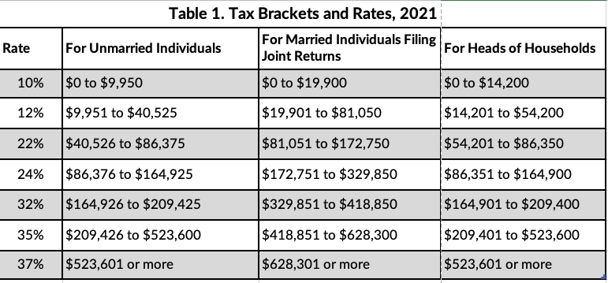

m4_include(../../../setup.m4)

## A Few Questions

### While loop.

Question: What is a good example of using a while loop where a for loop would make it much more difficult.

```
m4_include(wh11.py.nu)
```

or with a different way of offsetting to 0


```
m4_include(wh12.py.nu)
```


### Formatting.

Question:  Is the `{}` a dictionary in the format statement.

```
>>> a = 1.2345
>>> print ( "X Decimal Places {}".format(a) )
>>> print ( "2 Decimal Places {:.2f}".format(a) )
>>> print ( "In Order {} second {} third {}".format( "1st", 2, "last" ) )
```

<div class="pagebreak"></div>

### A better if-else example

Personal Income Tax Calculator.
This is not all of taxes.  This is just in the case where you have a job and you get a paycheck.
Let's say you have $88,000.00 a year in pay.  What do the "tax" calculations mean.

First there is a standard deduction.  For 2021 this is:

| Amount  | Description                          |
|---------|--------------------------------------|
| $12,550 | single taxpayers.                    |
| $12,550 | married taxpayers filing separately. |
| $18,800 | heads of households.                 |
| $25,100 | married taxpayers filing jointly.    |

This looks like a table we can turn into an "if"/"else" in python.

```
m4_include(stand1.py.nu)
```

The standard deduction is take off of your income before you calculate your taxes.
So the $88,000.00 minus $25,100 is: $62900.

This is the amount we use in the 2nd tax calculation.

If you search for "tax tables 2021" you get:

| Tax Rate | Taxable Income Bracket | Tax Owed                                     |
|----------|------------------------|----------------------------------------------|
| 10%      | $0 to $14,200          | 10% of taxable income                        |
| 12%      |  $14,201 to $54,200    | $1,420 plus 12% of the amount over $14,200   |
| 22%      |  $54,201 to $86,350    | $6,220 plus 22% of the amount over $54,200   |
| 24%      |  $86,351 to $164,900   | $13,293 plus 24% of the amount over $86,350  |

What this table means is that you pay 10% on the first $14,200.  Then take that off
then pay 12% on the next chunk of money.   

Let's implement that.

```
m4_include(stand2.py.nu)
```


### Import

Most of the time when you build a program you have multiple files.
Python deals with this with the "import" statement. 

The 2 most commonly used formats are:

```
import file
```

and 

```
from file imort function
```


Let's try it (this is the all in one directory version):

```
m4_include(main_0.py.nu)
```


```
m4_include(jane.py.nu)
```

Multiple Directories Version:


```
m4_include(main.py.nu)
```


```
m4_include(x/bob.py.nu)
```

or we can just import a single function

```
m4_include(main_2.py.nu)
```


## Tax table 




<div class="pagebreak"></div>

# Copyright

Copyright (C) University of Wyoming, 2021.

