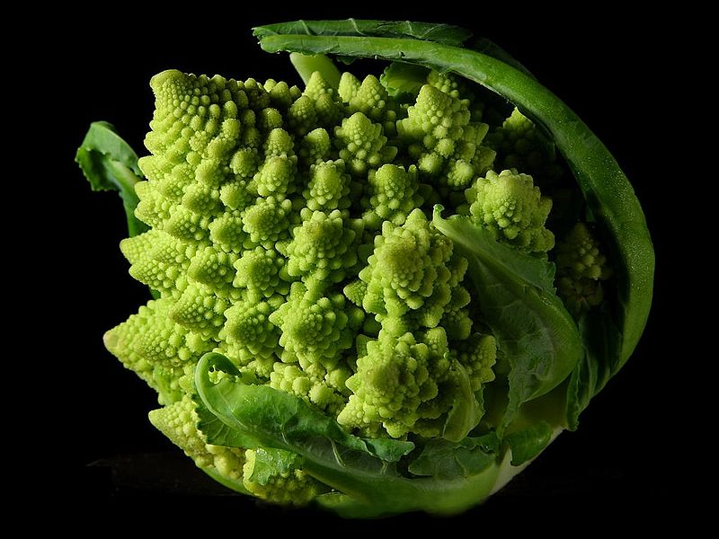
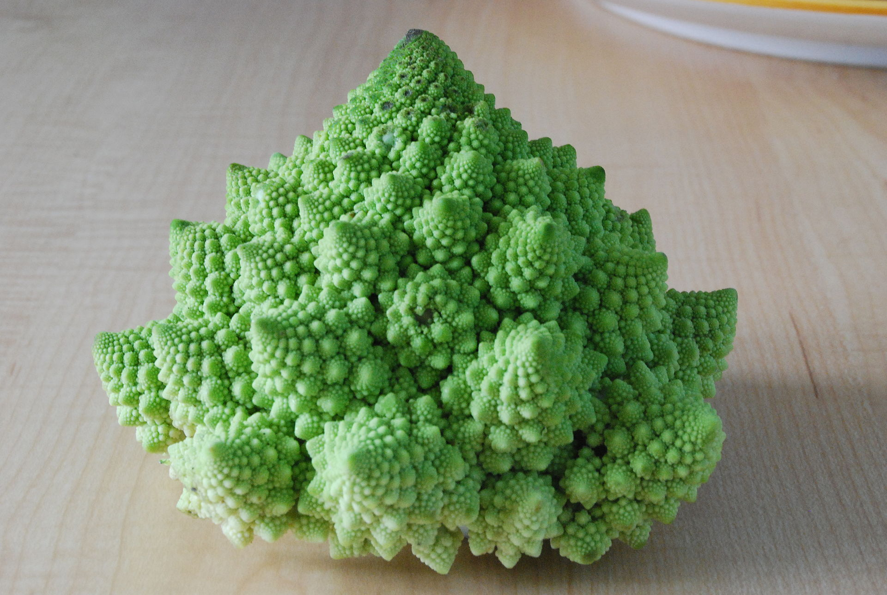
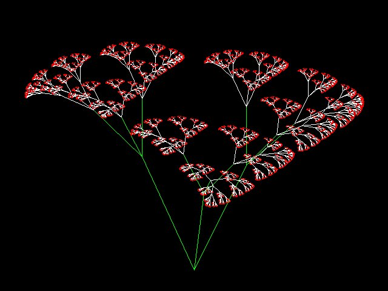
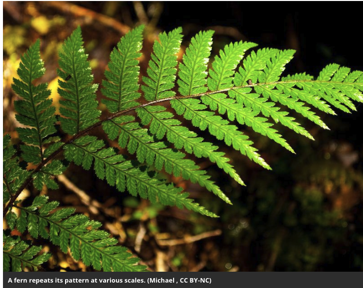
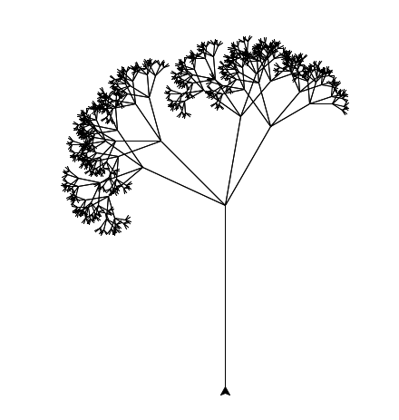
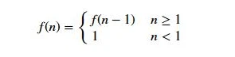

# Lecture 19 - Recursion

Why Recursion?














<div class="pagebreak"></div>

An example of a recursive addition

Let's define the sum of values from 0 to n as

```
    sum(n) = { 0 if n <= 0
             { n + sum(n-1) if n > 0
```

Then we can build a function that matches this.

```
  1: 
  2: def recursive_sum ( n ):
  3:     if n <= 0:
  4:         return 0
  5:     return n + recursive_sum(n-1)
  6: 
  7: 
  8: 
  9: # Automated Test
 10: if __name__ == "__main__":
 11:     n_err = 0
 12:     x = recursive_sum ( 5 )
 13:     if x !=  15:
 14:         n_err = n_err + 1
 15:         print ( "Error: Test 1: sum not working, expected {} got {}".format (  15, x ) )
 16:     x = recursive_sum ( 0 )
 17:     if x != 0:
 18:         n_err = n_err + 1
 19:         print ( "Error: Test 2: sum conversion not working, expected {} got {}".format ( 0, x ) )
 20: 
 21:     if n_err == 0 :
 22:         print ( "PASS" )
 23:     else:
 24:         print ( "FAILED" )
 25: 

```


What is a recursive function definition:



For a positive initeger:

```
    n! = n * (n-1) * ... * 2 * 1
```

or

```
    f(n) = n * (n-1) * ... * 2 * 1
```

or

```
    f(n) = n * f(n-1)
```

or

```
    f(n) = { n <= 1 : 1
           { n > 1  : n * f(n-1)
```

Now to Code:

```
  1: #!/Users/pschlump/anaconda3/bin/python
  2: 
  3: def calc_factorial(x):
  4:     # A recursive function to find the factorial of a number
  5:     if x <= 1:
  6:         return 1
  7:     else:
  8:         return (x * calc_factorial(x-1))
  9: 
 10: if __name__ == "__main__": 
 11:     num = 5
 12:     print("The factorial of", num, "is", calc_factorial(num))        
 13: 
 14:     err = False
 15:     v = calc_factorial(num) 
 16:     if v != 120:
 17:         err = True
 18:         print ( "Incorrect result: {n}! Expected {good} got {bad}".format(n=num, good=120, bad=v))
 19: 
 20:     if not err :
 21:         print ( "PASS" )
 22:     else :
 23:         print ( "FAIL" )
 24: 

```

Compare to an iterative version:


```
  1: #!/Users/pschlump/anaconda3/bin/python
  2: 
  3: def factorial_iterative(x):
  4:     if x <= 1:
  5:         return 1
  6:     nn = 2
  7:     rv = 1
  8:     while ( nn <= x ):
  9:         rv = rv * nn
 10:     return rv
 11: 
 12: if __name__ == "__main__": 
 13:     num = 5
 14:     print("The factorial of", num, "is", factorial_iterative(num))        
 15: 
 16:     err = False
 17:     v = factorial_iterative(num) 
 18:     if v != 120:
 19:         err = True
 20:         print ( "Incorrect result: {n}! Expected {good} got {bad}".format(n=num, good=120, bad=v))
 21: 
 22:     if not err :
 23:         print ( "PASS" )
 24:     else :
 25:         print ( "FAIL" )
 26: 

```


A better example is a fractal tree:


## Fibonacci Numbers


```
    fib(n) = { 0 : n = 0
             { 1 : n = 1
             { fib(n-1) + fib(n-2)
```


<div class="pagebreak"></div>

## Weed


```
  1: #!/usr/bin/python
  2: 
  3: import turtle 
  4: 
  5: def tree(length,n):
  6:     if length < (length/n):
  7:            return
  8:     turtle.forward(length)
  9:     turtle.left(45)
 10:     tree(length * 0.5,length/n)
 11:     turtle.left(20)
 12:     tree(length * 0.5,length/n)
 13:     turtle.right(75)
 14:     tree(length * 0.5,length/n)
 15:     turtle.right(20)
 16:     tree(length * 0.5,length/n)
 17:     turtle.left(30)
 18:     turtle.backward(length)
 19:     return
 20: 
 21: turtle.left(90)
 22: turtle.backward(30)
 23: tree(200,4)
 24: 
 25: input("Press Enter to continue...")

```

<div class="pagebreak"></div>

# The Koch curve.

So a program to run the Koch curve:

```

```


# Copyright

Copyright (C) University of Wyoming, 2021.
