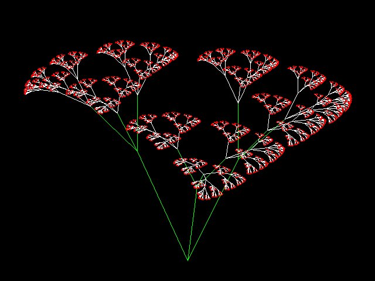

m4_include(../../../setup.m4)

# Lecture 19 - Recursion

Why Recursion?





<div class="pagebreak"></div>

What is a recursive function definition:


For a positive initeger:

```
    n! = n * (n-1) * ... * 2 * 1
```

or

```
    f(n) = n * (n-1) * ... * 2 * 1
```

or

```
    f(n) = n * f(n-1)
```

or

```
    f(n) = { n <= 1 : 1
           { n > 1  : n * f(n-1)
```

Now to Code:

```
m4_include(r1.fact.py.nu)
```

Compare to an iterative version:


```
m4_include(i1.fact.py.nu)
```


A better example is a fractal tree:


## Fibonacci Numbers


```
    fib(n) = { 0 : n = 0
             { 1 : n = 1
             { fib(n-1) + fib(n-2)
```


<div class="pagebreak"></div>

## Weed


```
m4_include(tree.py.nu)
```

<div class="pagebreak"></div>

# The Koch curve.

So a program to run the Koch curve:

```
m4_include(kotch.py.nu)
```


# Copyright

Copyright (C) University of Wyoming, 2021.
