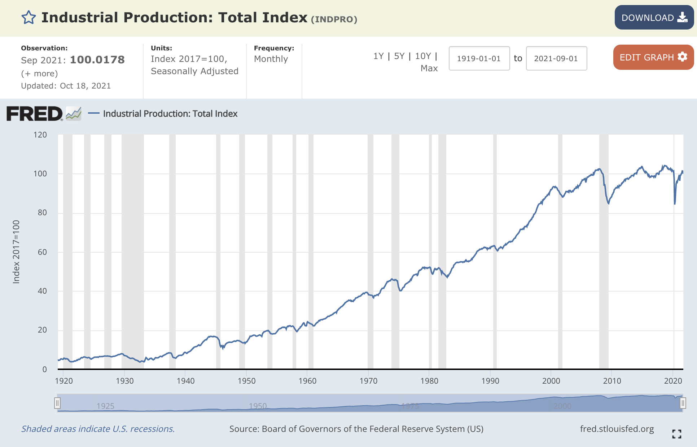

m4_include(../../../setup.m4)

# Lecture 22 - TensorFlow Hello World

## TensorFlow

### Important - Install tensor flow

```
$ pip install tensorflow
```

_Tokna Truck_

Hello World of Tensor Flow: from: [https://www.tensorflow.org/tutorials/quickstart/beginner](https://www.tensorflow.org/tutorials/quickstart/beginner)

There are also 2 YouTube videos to watch: [https://www.tensorflow.org/tutorials](https://www.tensorflow.org/tutorials)

```
m4_include(tf_hello_world.py.nu)
```

## What is `__future__`

This changes the behavior of Python to have additional capabilities.

```
(x_train, y_train), (x_test, y_test) = mnist.load_data()
x_train, x_test = x_train / 255.0, x_test / 255.0
```

## What the data looks like


Or run the program that generates this.

```
m4_include(show-data-minst.py.nu)
```


## Machine Learning (ML) or Artificial Intelligence (AI) and the Future of Work

_Windshield Washers_

84% of jobs that existed in 1900 were gone by 1990.

Not a zero-sum game.

War's are won not by the smarter but by the less stupid.



### ML will not make humans obsolete

Some types of jobs will go away.  Google (Waymo of Yesterday has started testing self driving in NY City)
a.1 million people are truck drivers.

[https://www.npr.org/sections/money/2015/02/05/382664837/map-the-most-common-job-in-every-state](https://www.npr.org/sections/money/2015/02/05/382664837/map-the-most-common-job-in-every-state)

Take Ways:

1. You don't have to be a genius to figure out when a job is going away.  You just need to be a little smarter than the people around you.  Retrial - or be part of the solution.
2. Job's going away is a huge opportunity.   Direct Store Delivery is an example.
3. MS Word destroyed the profession of "Secretary" -- did this make the world a better place?  At US West - a Phone company that no longer exists - there was an analysis of productivity
in getting rid of "Secretaries" and having people use Word.  The net of the analysis is it resulted in a 6% drop in productivity, and an 8% increase in cost.  Why....

NuCore steel is a good example.

"...AI programs are typically only capable of “specialized” intelligence, meaning they can solve only one problem, and execute only one task at a time. Often, they can be rigid, and unable to respond to any changes in input, or perform any “thinking” outside of their prescribed programming."
[https://www.forbes.com/sites/ashleystahl/2021/03/10/how-ai-will-impact-the-future-of-work-and-life/?sh=42e6a77a79a3](https://www.forbes.com/sites/ashleystahl/2021/03/10/how-ai-will-impact-the-future-of-work-and-life/?sh=42e6a77a79a3)

### ML - garbage in garbage out (GIGO)

Baked in bias.

[https://www.propublica.org/article/machine-bias-risk-assessments-in-criminal-sentencing](https://www.propublica.org/article/machine-bias-risk-assessments-in-criminal-sentencing)

[https://medium.com/analytics-vidhya/data-ethics-in-artificial-intelligence-machine-learning-72467b9c70f3](https://medium.com/analytics-vidhya/data-ethics-in-artificial-intelligence-machine-learning-72467b9c70f3)

1. Honor Lock uses an AI to analyze if you are cheating on a test.
2. Facial recognition that discriminates.  What is the rate of false positives.  Lowes in Illinois trial one of the witnesses revealed that the facial recognition has a 12% false positive rate.
3. Using AI to evaluate resumes - 75% of job resumes are now pre-screened by an AI.  Do resumes accurately reflect a job applicants abilities to do the job.

Self Generating GIGO

[https://futurism.com/artificial-intelligence-prejudiced](https://futurism.com/artificial-intelligence-prejudiced)

You look like a thing and I love you.

[https://www.youtube.com/watch?v=2ZiPEOFnK1o](https://www.youtube.com/watch?v=2ZiPEOFnK1o)

### More jobs will get created

A research project by MIT, "Artificial Intelligence And The Future of Work,” pains a very optimistic future.  Will a lot of jobs disappear.  Yep.
Will new better jobs get created.  Yep.  Will this lead to economic growth.  Yep.  Will we on average be better off.  Absolutely.

[https://www.healthline.com/health-news/this-new-test-can-detect-50-types-of-cancer-from-a-single-blood-draw](https://www.healthline.com/health-news/this-new-test-can-detect-50-types-of-cancer-from-a-single-blood-draw)

1. The research to do this is ML based.
2. The blood analysis uses ML to do the work.
3. New people have to draw the blood.
3. New people have to analyze the samples.
4. More cancer will be detected earlier - people will live longer healthier lives.
5. Yes there will be fewer people working in treating late stage cancer.  This is a good thing.
5. The company that developed this will make a gob of money - and I think that they should too.


