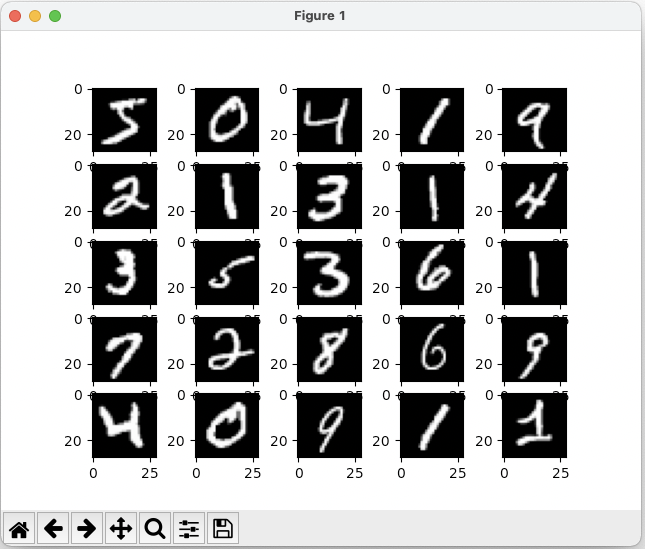

m4_include(../../../setup.m4)

# Lecture 22 - TensorFlow Hello World

## TensorFlow

Hello World of Tensor Flow: from: [https://www.tensorflow.org/tutorials/quickstart/beginner](https://www.tensorflow.org/tutorials/quickstart/beginner)

There are also 2 YouTube videos to watch: [https://www.tensorflow.org/tutorials](https://www.tensorflow.org/tutorials)

```
m4_include(tf_hello_world.py.nu)
```

## What is `__future__`

This changes the behavior of Python to have additional capabilities.

```
(x_train, y_train), (x_test, y_test) = mnist.load_data()
x_train, x_test = x_train / 255.0, x_test / 255.0
```

## What the data looks like



Or run the program that generates this.

```
m4_include(show-data-minst.py.nu)
```
