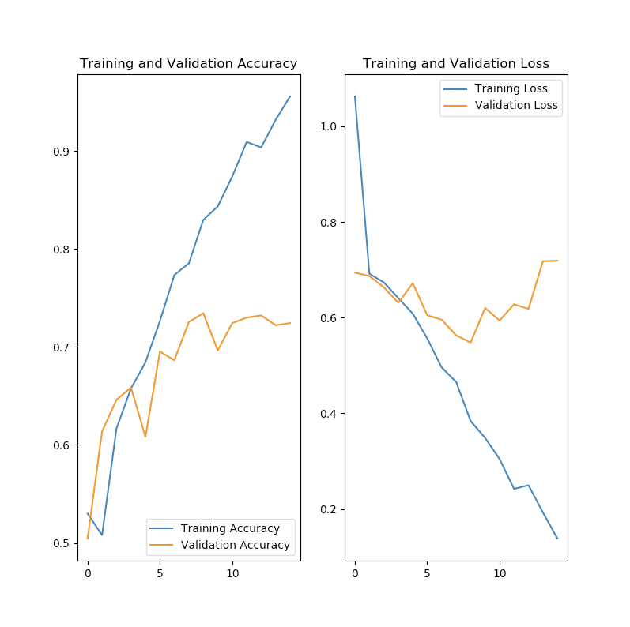
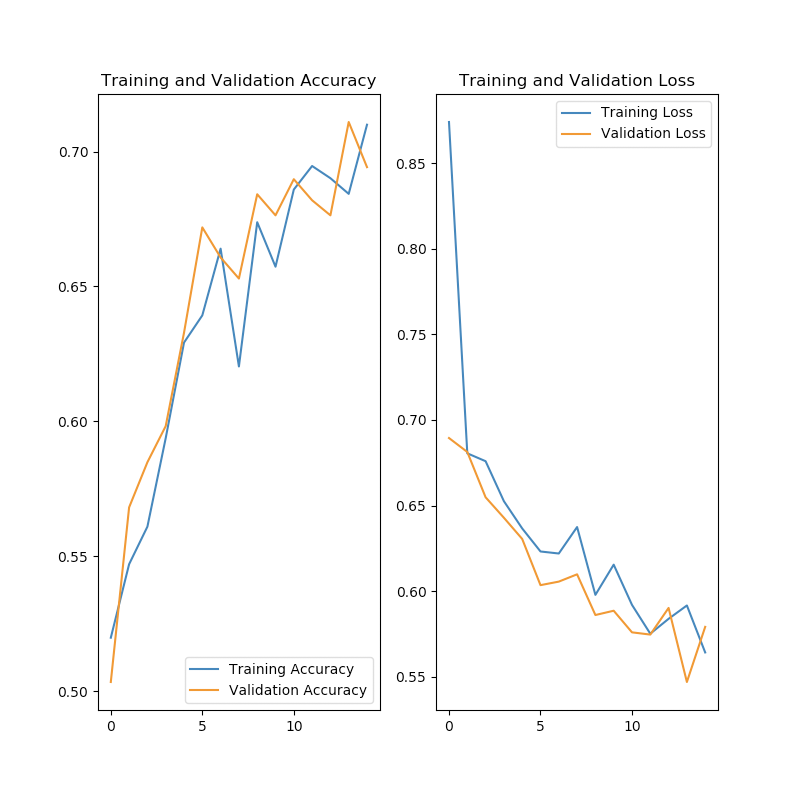

# Lecture 22 - Features / Overhitting etc.

## Generalization is what we want

When we fit a model we want it to generalized to new data.   Often this is not what we get.
This is usually due to "overhitting".

By trying to minimize "loss" in a model we end up with a model that only describes the
set of training data and has no predictive value.

This is especially true when we don't know what the "features" are and we are relying on
a deep network to identify the features - Images are an example of this.

Good / Bad of Computer Science - Working outside of your field.

Statistical errors, like overhitting are, not limited to Machine Learning: [https://www.theatlantic.com/magazine/archive/2010/11/lies-damned-lies-and-medical-science/308269/](https://www.theatlantic.com/magazine/archive/2010/11/lies-damned-lies-and-medical-science/308269/)

Goal: The goal of Machine Learning is to use a sample of data and to generate a set of predictive functions for new
data.  This estimate of the "probability" distribution requires a bunch of "assumptions" (explain).  Also the model
can't see the "real" or "whole" truth.  All the model gets is a "sample".   When the model has a good "fit" to
the data what assurances do you have that the model has "predictive" power on new never-before-seen data.

1. That the data is stable over time.
2. That you don't goof with what constitutes the training set and the testing set.
3. That there is a relationship that can be derived from this set - I.E. the set is large enough to reveal what you are looking for.
4. That the training set is representative of what you want to train on.

So when you sample a set of data it has to be an *independent and identical sample* - Examples can not influence each other.

The distribution of data can not change with the set.

You have to draw your sub-sets of training / validation data from the same set.

So... We violate this all the time.

Think about using ML for driving a car.  As soon as you add map-data and you say that the ML
will only need to user knowledge of where the car is - what path it is following / or planning
to follow - you have violated this set of "statistical" rules for validity.

## Training Set / Test Set / Validation Set

If you run your test multiple times you are "faking" the results.

So suppose we split into 3 sets.  A training set, A test set and a reserve set that we will
use for validation of the model after the training is complete.

## Bad Fit

## Good Fit

